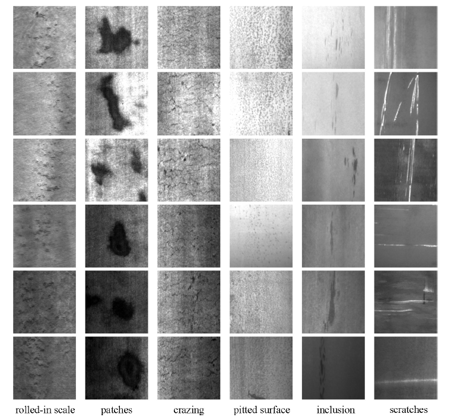

### Data

[NEU Surface Defect Database](http://faculty.neu.edu.cn/yunhyan/NEU_surface_defect_database.html) by [K. Song and Y. Yan, “A noise robust method based on completed local binary patterns for hot-rolled steel strip surface defects,” Applied Surface Science, vol. 285, pp. 858-864, Nov. 2013.](https://www.sciencedirect.com/science/article/pii/S0169433213016437)
This database contains six types of defects including crazing, inclusion, patches, pitted surface, rolled-in-scale, and scratches.




### Usage
- Setup with virtual environment (Python 3):
```
  python3 -m venv see-me-env
  source see-me-env/bin/activate
```
- Install the requirements:
```
  pip3 install git+https://github.com/qubvel/segmentation_models.pytorch
  pip3 install -r requirements.txt
 ```
Go to instance and open ssh in browser
```
cd SeeMe/seeMeEnv
source bin/activate
```

Go back to SeeMe directory and run the script with an example upload that is contained in ~/SeeMe/server/images/uploads
```
python3 SeeMePredictOnceNeu.py 4.jpg
```
You can see the created output image in the directory ~/SeeMe/server/images/model_outputs

The name of the output image is the same as the input image.
```
deactivate 
```
